# The State of the Art of Metadata Managements in Large-Scale Distributed File Systems — Scalability, Performance and Availability

## 背景

文件系统元数据是负责维护文件数据块的名称空间、权限语义和位置的数据。对元数据的操作最多可占整个文件系统操作的80%。因此，元数据服务的性能会显著影响文件系统的整体性能。大规模分布式文件系统（DFS）是由分布在不同站点的多个存储设备组成的存储系统，用于容纳数据文件，在大多数情况下，为用户提供独立于位置的访问接口。大规模DFS已被广泛部署为大量计算系统的基础，因此其元数据管理效率对大量应用程序至关重要，尤其是随着大数据时代的到来，这对底层存储系统造成了巨大压力。本文报道了大规模分布式文件系统中元数据服务的最新研究，该研究从三个指示性的角度进行，这三个角度始终用于表征DFS：高可扩展性、高性能和高可用性，特别关注它们各自的主要挑战及其发展的主流技术。

随着大数据应用程序的快速增长，当前的计算体系结构在规模和性能要求方面对存储系统提出了新的挑战。例如，在大数据应用程序中，如健康\[1]、流量\[2]和金融\[3]中的应用程序，数据的规模通常为TB、PB甚至EB。因此，需要大量的存储资源来存储和管理数据。

大量的数据分析任务需要跨不同存储服务器对数据的低延迟访问，这也对存储系统的读写速度提出了很高的要求。这对分布式文件系统（DFS）尤其重要，因为它以其简单性和多功能性已成为管理大数据存储的最有效方法之一。DFS的一些典型应用场景是大数据处理（例如，HDFS\[4]、GFS\[5]）、高性能计算（HPC）（例如，Lustre\[6]、Spectrum Scale\[7]、BeeGFS\[8]）和Web应用程序（例如，CephFS\[9]、GlusterFS\[10]）。因此，为了支持海量的数据存储和计算需求，以及硬件优化，高效的数据组织和管理也是必须考虑的关键技术之一。

### 元数据工作负载

文件系统元数据是一种特殊的系统数据，它描述了文件系统的结构特征，包括文件系统的类型、大小、状态（超级块）、访问权限、所有者、创建/更新时间以及每个文件和目录的数据块信息。文件系统的运行通常涉及对元数据的频繁操作，以便于其正常的数据访问操作。让我们以\[11]中的例子来说明，其中打开、读取并关闭基于inode的文件系统中的一个块大小的文件（例如/foo/bar）。整个过程如表1所示，在表1中，由打开引起的一系列读取操作用于定位文件栏的索引节点，其中文件读取操作是通过首先查阅索引节点，然后读取块，最后用写入更新索引节点的最后访问时间字段来执行的。这个示例只是从磁盘读取一个小文件，这涉及到相对大量的元数据操作。写文件的时候生活会更糟。通过这个例子，人们可以理解，对文件系统的50%到80%的访问是在元数据上进行的，尽管它只占整个数据空间的0.1%到1%的相对较小的部分\[12]，\[13]。

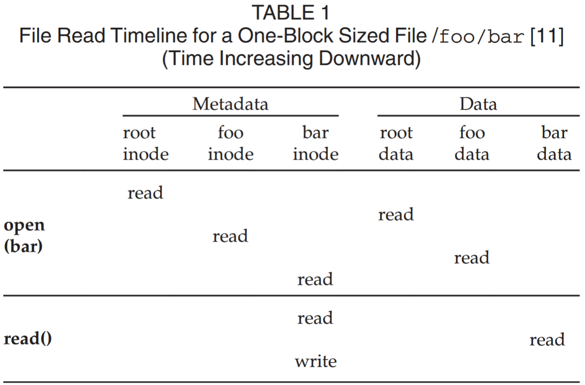

随着文件系统的发展，对元数据的研究也在不断进行。例如，Outsterhout等人\[13]通过记录用户级活动分析了UNIX 4.2 BSD文件系统访问模式的特征，发现超过50%的文件访问是对元数据进行的。Agrawal等人\[14]也进行了类似的研究，他们收集并分析了2000年至2004年间Windows Desktop计算机上10000多个文件系统的元数据访问快照。他们发现，一些文件类型在流行程度、命名空间使用以及文件大小变化方面具有强烈的时间趋势。Leung等人\[15]在最近的工作中也发现了类似的现象。基于NapApp的跟踪数据，他们从两个角度分析了如何在大规模存储系统中搜索元数据。从用户的角度来看，元数据搜索的行为主要体现在以下几个方面：1）为了细化结果，95%以上的搜索是针对多个元数据属性进行的；2） 大约33%的搜索仅限于命名空间的相关区域，这反映了文件通常由语义组织组织的事实；3）用户认为重要的搜索中，近25%涉及多个版本的元数据，主要来自用户为了解文件访问趋势而进行的“回溯”搜索。

从访问的元数据的角度来看，其模式也反映了用户搜索行为的特征：1）空间局部性：指的是命名空间中收集的文件的属性值。例如，John的文件大多位于/home/John子树下，而不是分散在整个命名空间中；2） 偏度：元数据的值具有高度的偏度，这意味着这些值的分布是不对称的，一些流行的元数据值占据了大部分的值空间。例如，80%的文件具有最常见的20个文本和大小值。

最近，肖等人\[17]进行了更详细的分析，以表征包括云存储在内的各种存储平台上文件系统名称空间的结构和操作分布的偏斜性。他们发现，文件系统命名空间显示了目录大小的重尾分布，由几个小目录和少量相对较大的目录表示。例如，在正在检查的60个文件系统中，90%的目录包含的目录条目少于128个。另一个有价值的发现是，随着存储系统容量的增长，大型目录会继续增长。除了目录文件，正常文件大小也显示出类似的分布。在主流文件系统中，64%的媒体文件小于64 KB，这意味着系统的大部分是小于几百KB的小文件。即使在用于大数据处理的大规模集群文件系统中，这一观察结果也是正确的\[18]。至于目录树的深度，与目录的大小不同，它不会随着系统容量的增加而增长。在所考虑的系统中，目录树的绝大多数（约90%）深度不超过16。在其他研究\[19]、\[20]中也观察到了这种现象。与Leung等人感兴趣的元数据值的偏度不同，Xiao等人研究了元数据操作的偏度，他们发现在所有被检查的跟踪文件中，只有一到两个操作占主导地位：即打开操作和读取目录操作。

### 元数据管理架构

随着DFS体系结构在过去几十年中的发展，其相应的元数据管理也在不断改进和优化。传统上，元数据和数据通常放在相同的存储服务器上。关于访问效率，元数据通常在物理上存储在其描述的数据附近，这意味着在过去\[22]、\[23]、\[24]中不涉及“元数据服务器（MDS）”的概念。随着DFS中数据的快速增长，研究人员发现元数据服务的可扩展性和性能往往是这种架构的瓶颈。因此，Gibson等人\[25]提出了一种独立的元数据服务器架构，被视为分离元数据服务器的先驱。由于文件操作以及整个DFS的数据一致性会导致对元数据执行大量操作，因此元数据操作的性能对DFS的总体性能至关重要。然而，这个问题在早期的DFS中并没有那么严重，因为它们通常都很小，因此数据和元数据通常存储在同一台机器中，这是一种伪非分离架构。不幸的是，随着DFS大小的增加，由于元数据检索需要涉及更多的服务器，这种非分离体系结构的性能显著下降，从而导致了巨大的开销。为了解决这个问题，在现代DFS中，元数据与数据本身是分开存储的，这导致了一种新的分开的体系结构。有了这种架构，我们可以通过单独从MDS中检索来访问所有数据，大大提高了MDS操作的速度，增强了DFS的可扩展性和性能。鉴于这些优点，目前主流的DFS通常采用分离的架构来管理其元数据，如CefFS、GFS等。总之，与传统的架构相比，新的架构更容易扩展并提高元数据服务器的性能。

当前主流的大规模DFS采用了将元数据管理与文件内容（数据）分离的结构，如图1所示。该结构主要由三部分组成：客户端文件系统、元数据服务器和对象/数据存储设备（OSD/DSD）。每个组件的功能是：客户端提供一个文件系统访问接口；OSD/DSD保存文件的所有数据；MDS的职责是存储和管理元数据。

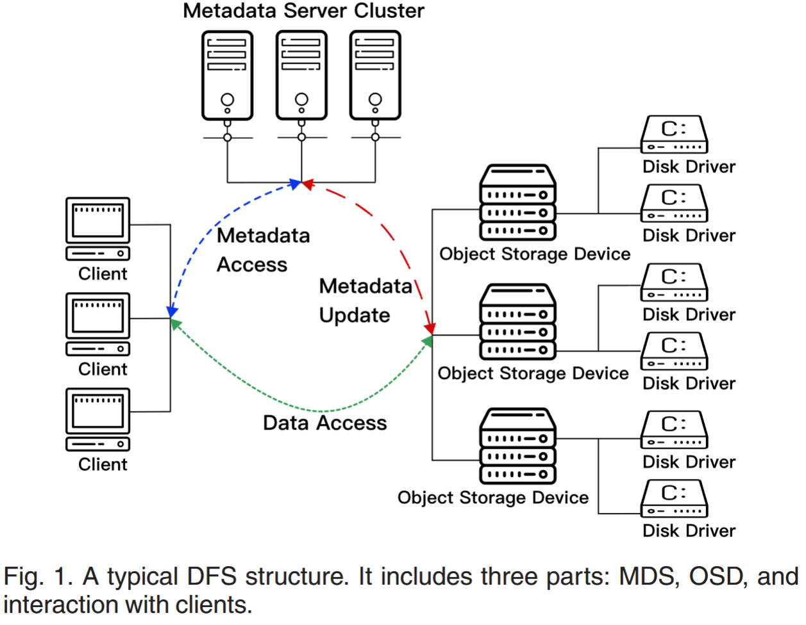

MDS系统通常使用单个MDS或MDS集群来维护文件系统的全局名称空间和文件数据存储的物理视图。元数据信息以带外方式为客户端提供服务。同时，MDS系统还管理数据存储设备。当客户端需要读取或写入数据时，它将首先与MDS通信以检索相应的元数据。然后，客户端根据元数据从OSD/DSD传输数据。此数据传输仅发生在客户端和OSD/DSD之间。此体系结构有效地减少了MDS的工作负载。通过扩展，可以充分利用DSD集群的聚合I/O带宽来提高I/O系统的整体性能。

由于MDS的性能是DFS的一个关键因素，除了单独的设计外，还提出了许多其他研究项目，如CephFS\[9]和HopsFS\[26]，通过利用建立在数据库上的分布式MDS来优化MDS的性能。数据库的开发不仅为MDS提供了方便简洁的读/写接口，还使元数据能够通过使用特定的索引结构（例如，日志结构的合并树（LSM-tree）\[27]、范围查询优化的持久ART（ROART）\[28]等）来实现高性能。

为了保留目录位置，现代主流的符合POSIX的DFS通常将inode和dentry保留在同一服务器上。一些研究还探讨了inode和dentry是否可以放置在不同的服务器上，例如CFS\[29]，它是一种典型的DFS，具有独立的存储集群，用于根据内存使用情况存储和容纳元数据。为了有效地实现基于利用率的元数据放置，同一文件的索引节点和dentry可以分布在CFS中的不同元数据节点上。CFS的架构如图2所示。其中元数据子系统由一组元节点组成，每个节点由数百个分区组成。因此，整个子系统可以被视为元数据的分布式内存数据存储。

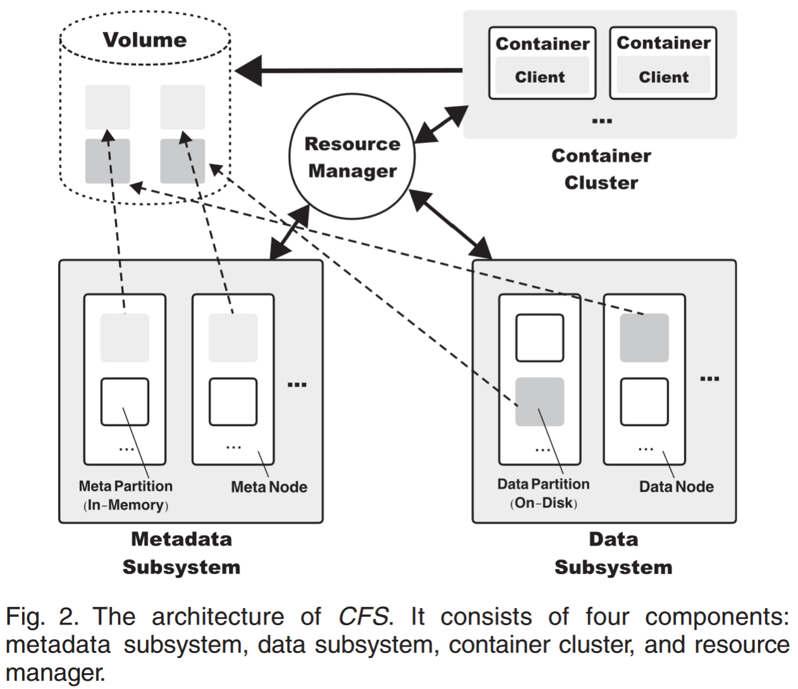

相比之下，GlusterFS是2006年提出的一种早期、广泛使用的DFS，不使用MDS\[10]。GlusterFS的主要思想是通过计算文件名和路径的哈希值来定位数据，而不是使用MDS进行元数据管理，这意味着一旦给定文件名和文件路径，定位就高效了。GlusterFS在已知文件名和路径的情况下执行效率很高，而在其他情况下相应的性能较差。

### 元数据管理的挑战

早期的一些DFS，如GFS\[5]、HDFS\[4]和BWFS\[30]，采用了单一的MDS架构。在小规模的情况下，单个MDS在降低元数据访问的通信成本和以低开销保持元数据一致性方面显示出优势。随着云计算和大数据的发展，单个MDS体系结构在存储系统的可扩展性、性能和可用性方面面临着相当大的挑战。例如，在EB规模的大规模存储系统中，元数据可以增加到PB规模\[31]，这导致MDS系统的可扩展性要求很高。

在许多应用程序中，元数据通常是高度共享和并发访问的，高频访问元数据需要低延迟保证\[32]，这反过来又需要MDS系统的高性能。最后，作为文件读写的关键部分，单个MDS的崩溃大大降低了服务的可用性，这是提供数据服务的基本保证。

考虑到这些因素，一个直观的想法是采用MDS集群技术来实现高可扩展性、高效率和高可用性。因此，许多企业和研究机构对基于MDS集群架构的MDS的高可扩展性、高性能和高可用性要求进行了广泛深入的研究（例如，CephFS\[9]、Lustre\[6]、\[33]、\[34]、\[35]、CFS\[29]）。我们为MDS开发中的一些关键技术制定了时间表。如图6所示，3，随着分离MDS的出现，人们已经进行了大量的工作来提高MDS的性能和可扩展性优化，并相应地提出了新的优化技术。请注意，图中只列出了一些关键的代表作。

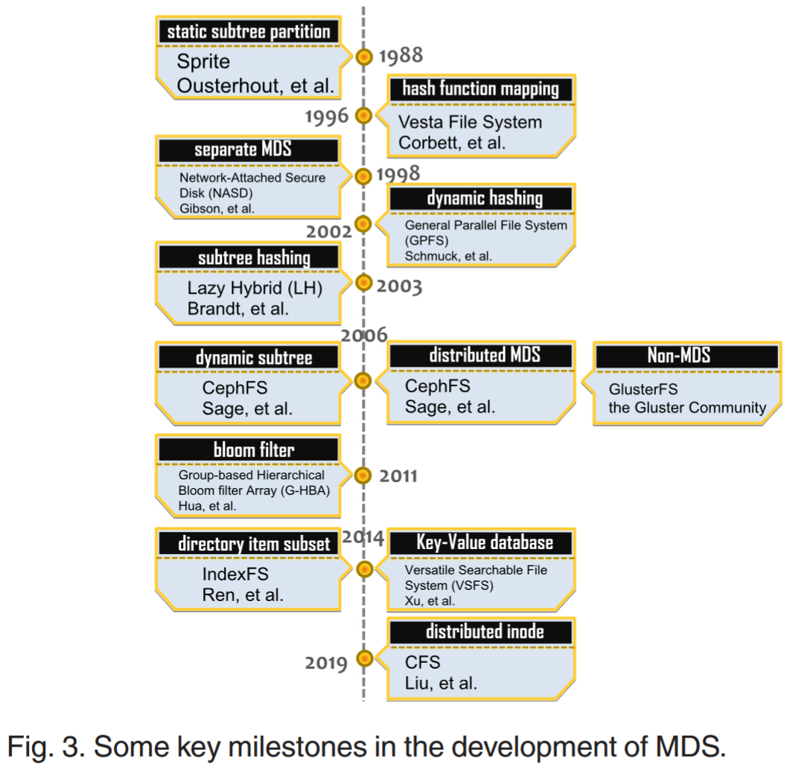

## 用于元数据服务的高可扩展技术

主要的挑战是如何将文件系统的整个命名空间划分为多个切片，并将它们均匀地分布在多个MDS中。除了最初的划分，它还旨在有效地处理访问负载的变化和MDS的弹性增加和减少。本文从元数据的组织查询角度，将现有的技术归纳为静态和动态空间划分方法，并进行了比较。

### 静态空间划分方法

**静态子树划分方法**

静态子树方法是一种相对简单的分区方法，常用于早期的DFSs，如NFS\[51]、AFS\[52]和Coda\[53]等，以及最近的一些大规模分布式文件系统，如HDFS\[54]等。这种方法通常由系统管理员决定如何划分目录的层次结构，并将每个“碎片”（通常是子树）分配给指定的MDS。当文件的元数据需要由相对少量的服务器重复访问时，这种方法是高效的。而其主要缺点是不能动态地处理不平衡的元数据工作负载。也就是说，由于访问不均衡而导致的“热点”没有得到很好的处理。例如，当同一目录子树中的一组文件在短时间内被频繁访问时，它们所在的服务器将非常繁忙，从而成为整个系统的性能瓶颈。为了解决这个问题，子树复制在某些情况下将发挥特殊的缓解作用。尽管如此，它也可能增加存储成本和维护拷贝一致性的开销。此外，当增加或减少MDS时，这种划分方法也存在一些困难。由于命名空间分区的重新规划，一些子树需要在MDSs之间迁移，导致性能下降。

**哈希函数映射方法**

基于哈希的方法是将哈希函数应用于文件名，以定位文件的MDS。这种方法不仅减少了MDS之间的工作负载失衡，在MDS集群之间均匀地分配服务请求，而且还允许客户端直接检索元数据。例如，Vesta\[55]和zFS\[56]利用文件路径名的哈希来定位数据和服务器。这种方法的主要缺点是缺乏数据局部性。此外，路径名的修改会导致MDS集群之间大量元数据的迁移，增加网络工作负载。与静态哈希方法一样，由于被查询文件的前缀目录存储在不同的服务器上，访问控制和路径查询也带来了大量的网络开销。此外，哈希函数会随着服务器数量的不同而变化，这也会导致大规模迁移。

目前，文献\[57]中已经针对这些问题提出了一些改进建议。与传统的基于文件路径名哈希的方法不同，Xu等人\[57]建议使用哈希函数将嵌套点下的整个目录子树分配给同一MDS，这有利于维护局部性。为此，他们设计了一个基于simhash\[58]，\[59]的新的本地化哈希函数。主要思想是哈希每个目录的子目录（2字节编码）。之后，索引节点的哈希值被链接到同一个文件，形成48B的哈希值，而不是对整个路径名进行哈希。除了维护局部性，这种方法还可以自由命名新的文件和目录。对于文件在目录之间的迁移，这种方法可以快速更新哈希值。

值得注意的是，就超大规模处理数据量而言，这些基于哈希映射的方法在行业中更受青睐。例如，由Facebook\[60]提出的一种EB级分布式文件系统Structural利用每个元数据层的哈希分区来避免热点问题。由于数据更新，Structural仍面临权衡和妥协。为了有效减少修改目录属性引起的数据更新和迁移，一些研究人员采用了一种替代策略，将目录路径属性与目录对象分离。这种方法的优点是减少了前缀目录的重叠缓存，从而提高了MDS缓存的利用率和命中率。此外，它还增强了目录的存储位置，从而减少了磁盘I/O操作。然而，由于检索目录索引服务器的开销增加，这种方法可能会对整个系统的可用性产生负面影响。

**子树哈希方法**

子树分区增强了对元数据访问局部性的支持，但它仍然存在存储负载不平衡的问题。基于哈希的方法以牺牲局部性支持为代价，实现了更好的负载平衡。因此，混合子树哈希方法将这两个方面集成在一起，以相互利用。混合方法通常利用哈希函数来实现元数据在MDS之间的平衡分布，并且它支持基于分层目录结构的目录和文件的语义查询和控制。如图5所示，子树+哈希方法采用了一种混合方法来在这两个度量之间取得良好的平衡。它首先通过将DFS的名称空间划分为子树来实现良好的虚拟局部性，然后通过在物理上将划分的子树哈希到不同的MDS服务器来实现较好的负载平衡。

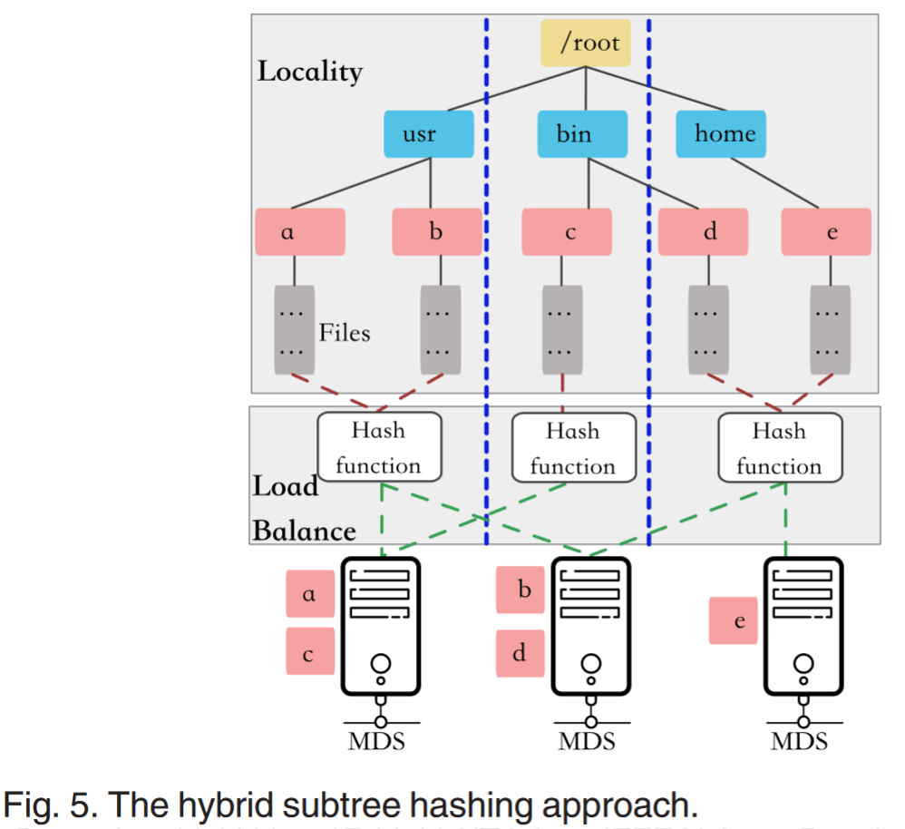

基于这一思想，Brandt等人\[48]提出了一种称为懒惰混合（LH）的混合策略。一方面，该方法采用元数据查找表将路径的哈希值与元数据的位置解耦，从而实现对服务器资源的弹性管理。另一方面，具有双条目的访问控制列表（ACL）使得额外的权限操作可以避免。此外，LH的一个独特之处是采用了一种混合机制，将元数据的迁移推迟到修改后访问，从而降低了MDS之间的突发网络流量。然而，尽管LH通过哈希函数将名称空间树分布在不同的服务器上，但它忽略了单个超大目录的影响。过大或倾斜的目录严重破坏了文件系统的可扩展性。

Swapnil等人提出了GIGA+\[61]，这是一种基于目录分区和哈希方法的元数据管理服务。这种方法在局部性和负载平衡之间进行权衡，为命名空间树管理提供了一种更细粒度的方法。

尽管LH和GIGA+具有许多优点，但它们仍然受到元数据迁移带来的网络开销的影响。徐等人\[57]提出了一种类似的系统DROP，用于EB级存储系统的元数据管理。DROP使用哈希函数来分发元数据。同时，它维护一个全局目录，以执行目录属性相关的操作，如读取和写入权限。为了实现这些优势，他们使用了称为localhold的哈希函数，并实现了基于直方图的动态负载均衡策略，以克服哈希函数造成的负载不平衡。

尽管DROP在为EB级文件系统提供服务的效率和可扩展性方面都有显著提高，但需要在元数据存储中维护额外的哈希密钥，这导致了巨大的额外空间需求。为了解决这个问题，Gao等人提出了AngleCut\[31]，\[62]，这是一种用于大规模DFS的基于环的元数据管理策略，用于对元数据命名空间树进行分区。在大多数情况下，通过在本地目录树中安装具有特定点的远程目录树，将分布式文件系统绑定到本地文件系统的命名空间中。因此，DFS的名称空间组织结构是树状的，我们使用名称空间树来表示整个名称空间。与DROP类似，使用了一种新颖的保留局部性的哈希函数将元数据命名空间树哈希到AngleCut中的线性密钥空间上。随后，将计算元数据节点的角度值，以将节点分配给类弦环。

AngleCut的系统架构如图6所示，其中节点a-d表示位置由特定哈希函数计算的元数据节点，节点1-6表示虚拟MDS，它们也通过相同的哈希函数映射到环上各自的位置。根据Chord定义\[63]，元数据按顺时针方向分配给哈希环上最近的MDS。如上所述，维护元数据名称空间树的层次位置是MDS的重要组成部分，因此使用保持局部性的哈希（LPH）算法尽可能频繁地将接近的元数据节点分配给同一MDS。然后，AngleCut通过元数据访问频率的累积分布函数（CDF）将虚拟服务器分配给真实的MDS。如图6所示，服务器Node1和Node4由MDS A管理。基于这种设计，AngleCut不仅提高了系统的负载平衡度和系统的可扩展性，还减少了额外的不必要空间的使用。

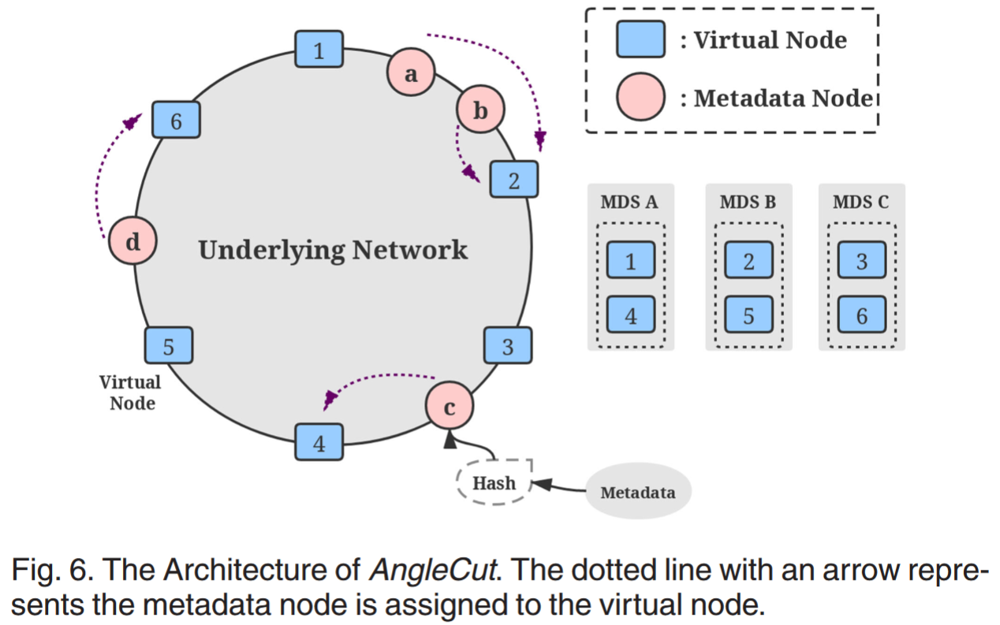

### 动态空间划分方法

动态空间分区方法将全局命名空间分配给不同的MDS，当工作负载发生变化时，使用动态负载平衡机制在MDS集群中以不同的粒度重新分发元数据。动态空间划分方法在保持访问局部性、自适应负载变化和灵活使用资源方面表现出相对优势。目前，主流的大型DFS，如Ceph\[9]、GFSII\[64]、GlusterFS\[5]、\[10]和Luster\[65]，支持各种形式的动态元数据管理。对于动态子树划分方法，研究主要集中在负载均衡技术和相关资源灵活性等问题上。

**动态子树方法**

负载平衡问题是将那些重负载节点的工作负载迁移到轻负载节点。在这个阶段，负载平衡通常以子树为最小单元执行，以保持访问的空间局部性。Ceph是一个典型的系统，它利用动态子树分区来实现负载平衡\[9]。每个MDS使用指数时间衰减计数器，来根据目录结构测量元数据访问的频率。对特定元数据项的任何操作，都将增加从根到沿着访问的元数据节点的路径的所有目录节点的访问计数，因此每个MDS将提供加权目录树来表征最近的元数据负载分布。通过周期性地相互发送心跳信息，在MDS之间比较MDS的负载值，然后重负载节点可以将识别的子树迁移到轻负载节点，同时，新节点已经成为子树的权威节点。在Ceph中，目录条目的权限节点由目录条目的路径名或其inode号的哈希值定义。随着目录的增长或访问频率的增加，可以将其哈希到其他节点。随着目录的缩小或访问频率的降低，目录子树的不同部分可以从多个服务器聚合到一个服务器，这为灵活的资源管理提供了支持。

Ceph采用了一种放置算法，称为可伸缩哈希下的受控复制（CRUSH）\[66]，以进行从对象到分层映射的结构化映射，该映射由一组OSD节点组成，然后将对象均匀分布在可用的OSD上。尽管Ceph在负载平衡方面有着不错的性能，但由于CRUSH算法的缺陷，它在扩展集群节点后会出现不受控制的数据迁移。为了在Ceph中实现可控的数据迁移，Wang等人\[67]通过引入从对象创建时间到集群扩展时间的额外时间维度映射，向CRUSH算法提出了一种新的扩展MAPX，其中对象创建时间戳可以作为一种更高级别的存储元数据来维护。实验结果表明，基于MAPX的Ceph在尾部延迟方面比基于CRUSH的Ceph好4.25倍。

蓝鲸元数据管理系统（BWMMS）是为EB级存储开发的MDS集群技术\[68]。通过pNFS\[69]和蓝鲸设备文件系统（BWFS）的集成，BWMMS实现了一种细化到目录的元数据分发策略。与Ceph中的加权子树方法不同，BWMMS对全局命名空间进行分区，并为每个分区指定存储目录的总数。一旦分区被填满，新目录将被分发到其他元数据子卷。以循环方式执行元数据子卷的选择，以将元数据分发到各个MDS。这个想法与GPFS处理大目录的扩散列函数的方式有些相似。不同之处在于，完美分数中的内容不会被分割。BWMMS不使用哈希路径名来定位MDS。相反，它在内存中维护MDS Map数据结构，以存储元数据子卷和MDS之间的映射关系。尽管这种方法不依赖于路径，但它引入了MDS Map带来的控制问题。BWMMS的另一个问题是，命名空间的划分只考虑目录条目的大小，而不考虑对目录条目的访问频率，从而导致访问热点问题。

由于每个MDS都有自己的元数据均衡器，因此需要一个检测信号机制来保持MDS集群中的一致性。在重新平衡负载时，平衡器需要将inode发送到其他MDS节点，因此需要讨论分布和局部性之间的性能权衡。当元数据被不必要地分发时，性能可能会变得更差，请求的数量会增加，因为MDS需要从其他MDS请求远程元数据来进行文件系统操作，这意味着动态子树导致了根据所述资源的特性来决定如何迁移资源的复杂性。在探索性能和稳定性方面的位置性与分布性，并深入了解真正的瓶颈方面，Sevilla等人\[70]提出了一种用于CephFS的通用可编程元数据均衡器，称为Mantle。

**目录项子集方法**

对于元数据访问特性，IndexFS\[49]采用分层结构来设计MDS集群，统一处理元数据和小文件，并考虑其核心外存储优化。每个目录都建立在一个随机的主服务器上，所有文件的目录条目也存储在同一服务器上。当不断增加的目录的大小超过预定阈值时，IndexFS将继续对其进行增量划分，并将子集随机存储在备份MDS中。为了实现负载平衡，备选MDS的选择基于“两种选择的力量”\[71]的原则，该原则检测两个随机选择的服务器，并将目录子集放置在目录数量相对较少的服务器中。可以看出，与基于子树分区的系统不同，IndexFS系统的元数据分布在MDS中存储的目录条目的子集中。对于后台存储优化，IndexFS利用LSM树\[27]（当前键值存储系统中常用的一种技术）来表示和存储元数据和小文件数据。每个服务器存储和管理部分文件系统元数据，并使用LevelDB\[72]将元数据和小文件数据打包为一个扁平的大文件。然后，平面文件将被格式化为排序字符串表（SSTable）\[73]，并存储在共享集群文件系统中。这样，IndexFS就可以为LevelDB的键值接口检索元数据提供服务。尽管元数据访问的可扩展性有所提高，但研究表明，这种方法在很大程度上依赖于利用缓存的局部性来降低路径查询的成本\[17]，\[74]。因此，在不同路径访问的情况下，缓存更新将导致这种方法的重大热点问题。

**动态哈希方法**

GPFS是IBM为共享存储设计的分布式文件系统\[75]，它通过可扩展哈希在块级别实现目录组织的动态扩展。目录的条目存储在磁盘块上，磁盘块由目录名哈希值的低阶n位寻址，其中n取决于目录的大小。具体来说，当为目录磁盘块创建新的目录条目时，如果磁盘块已满，则将其分为两部分。新磁盘块的逻辑块号由旧块号的n+1位位置“1”实现。目录条目是旧磁盘块中第n+1位的哈希值为“1”的目录条目的迁移。旧磁盘块的逻辑块号的第n+1位为“0”，其目录条目也由剩余的目录条目组成，这些目录条目的第n+1位具有“0”的哈希值。因此，无论目录文件的大小和结构如何，查询通常只需要一个目录块查询。因为它是共享存储，所以所有节点都可以参与元数据管理，包括名称空间。元数据的一致性通过节点之间的令牌控制来保证。基于同样的想法，一些研究人员将列哈希函数应用于MDS集的编号，以实现弹性服务器资源中的负载平衡。然而，由于负载划分的随机性，该方法不能很好地支持元数据访问的局部性。

在华等人\[76]提出的基于组概念的分层元数据管理中，组的拆分和合并也采用了类似的方法。类似地，AbFS2\[77]元数据模型结合了哈希/表和B+树，这是基于相同的思想。然而，这些方法仅旨在平衡存储空间，而缺乏对热点的处理。

为了解决热点问题，AngleCut\[31]，\[62]采用周期性随机游走来估计元数据访问频率的累积分布函数（CDF）。由于节点的访问频率随着时间的推移而变化，CDF可以捕获MDS工作负载不平衡引起的热点，从而AngleCut可以相应地在基于LPH的散列环上重新分配元数据。特别是，Kettaneh等人\[78]提出了一种存储系统NICE，它利用软件定义的网络来优化DFS的可扩展性。NICE中的MDS负责管理存储系统的元数据，该元数据包括NICE中存储节点的信息以及每个存储节点所服务的哈希空间（分区）的范围。通过存储节点的检测信号，MDS可以检测成员身份的更改（例如，加入和失败），并控制OpenFlow交换机更新转发表。

### 总结

各种方法和对应的论文

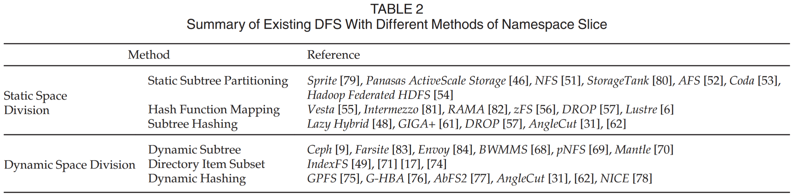

从访问热点、负载平衡、对访问局部性的支持、资源弹性和命名空间更改五个方面对这些方法进行了比较。这些方法各有优点。例如，静态哈希方法（即哈希函数映射和子树哈希）可以有效地避免热点问题。与其他方法相比，静态子树划分方法在负载平衡方面表现不佳。对于局部性，朴素的哈希方法不能保持良好的数据局部相关性，因此这些方法（即基于哈希函数的映射和动态哈希）的局部性性能比其他方法差。相比之下，对于可扩展性的成本，由于动态树结构，动态子树可以有效地降低添加或删除节点时的调整成本。当前的技术在适应资源灵活性和文件名更改方面仍然很昂贵。

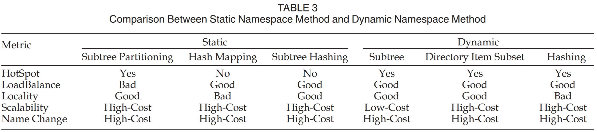

总之，所有这些方法都试图在局部性和负载平衡之间进行权衡。特别是，基于子树的方法更侧重于局部性，而基于哈希的技术通常侧重于负载平衡。其他一些人试图通过使用不同的策略来混和这些方法，但他们在各个方面的性能都有所下降。因此，不存在同时对这两种指标有效的通用解决方案，如何将这些方法结合起来，以合理的成本在局部性和负载平衡之间取得平衡，从而有利于可扩展性，这仍然是一个值得进一步研究的开放问题。

## 用于元数据服务的高性能技术

我们将MDSs的高性能技术大致分为三类。第一，用于解决MDS可扩展性的问题，如负载平衡、热点消除等，以提高整个文件系统的性能。第二，针对现有元数据的属性集，为各种查询应用程序建立了新的索引机制，以提高其效率。第三，我们称之为MDS的增值技术。其核心思想是为各种应用程序扩展元数据集，每个应用程序都有不同的用途。扩展的元数据集称为增值元数据集，我们通过利用面向应用程序的增值MDS来提高特定的应用程序性能。

### 缓存和复制

缓存和复制是两种关键技术，通常用于实现MDSs的高可扩展性。同时，由于它们可以通过在内存中缓存热点元数据，或以更易于访问的方式组织元数据，来大大缩短响应时间，无论集群是缩小还是扩大，缓存和复制都可以显著降低MDS检索元数据的延迟，从而提高DFS的整体性能。此外，缓存可以在服务器端和客户端实现，除了可扩展性之外，还可以尝试解决性能问题。

因此，缓存和复制在提高整个文件系统的性能方面也发挥着关键作用。例如，在Ceph中，为了消除用于负载平衡的访问热点，研究中同时采用了权限节点和协作缓存，其中为每个元数据项定义了权限节点，以实现在特定时间对元数据的串行访问，记录更改（如写入外部存储器），并在存在相同数据的多个副本时保持高速缓存的Consistent和Coherent。协作缓存要求，当元数据项在另一个MDS的缓存中有一个副本时，授权节点有权与其通信，以保持缓存Coherent。如果删除了非授权MDS的缓存副本，则还会通知授权节点删除其本地副本以保持缓存Consistent。权限节点的概念分散了元数据控制，是实现复制技术的基础。协作缓存保持副本的一致性\[85]。

Consistent：指同一个区域被多个用户读写，保持数据一致性。就是要保证不同用户的顺序性，通过load-acquire/store-release，或者加锁，或者做memory barrier等方法。

Coherent：指同一份数据的多个副本间一致性，例如一份数据被多个用户cache，用户修改后如何保证其他用户访问最新数据，不是读cache的旧数据。

在分布式元数据管理中，路径名查找通常被认为是一个主要的性能因素，限制了系统的可扩展性并影响了整个系统的性能。肖等人\[86]通过将ShardFS\[87]与IndexFS进行比较，对这一问题进行了深入的定量研究。为了提高元数据的访问性能，IndexFS在客户端上为路径名和访问权限的每个组件维护一致的查找缓存。通过对每个目录条目使用租约，它减少了路径名更改导致的无效数量，提高了元数据查询服务的性能。相比之下，ShardFS利用MDS群集中复制路径的查询状态来确保每个文件操作仅作用于一个节点，从而消除了对多个服务器进行基于锁定的访问的需要。此外，通过对元数据操作进行分类，专门的分布式事务的实现进一步降低了复制成本。这两种方法尽管有各自的优点，但也有各自的问题。在IndexFS中，当一些访问的目录条目不在缓存中时，会发生缓存未命中，因此客户端必须经历高查询延迟，而在ShardFS中，客户端的高延迟主要是由于目录元数据更新导致的维护多副本一致性的开销。

此外，缓存的更新机制也是一个值得研究的重要问题。由于CPU缓存和计算机内存的读/写速度不同，MDS中通常采用两种缓存更新方法：直写和写回。在直写高速缓存中，数据在高速缓存更新的同时写入主存储器。在写回缓存中，只有在缓存未命中后，数据被迫从缓存中在线替换时，数据才会写入主内存，处理器的写入只会更新缓存。与直写缓存相比，回写缓存通常能在MDS的更新操作中获得更好的性能。因此，它被广泛用于各种DFS，比如Lustre，它通过使用回写缓存克服了修改元数据的链路延迟\[88]。

缓存机制可以在服务器端或客户端实现。传统上，它是在服务器端实现的。客户端缓存也非常值得研究，因为它可以显著减少服务器端的工作负载，即使会产生一些一致性成本。例如，Qian等人提出的分层持久客户端缓存（LPCC）\[34]，是专门为提高HPC文件系统（例如，GPFS、Lustre和BeeGFS）的性能而设计的客户端缓存机制。此外，Cheng等人\[89]提出了一种基于LPCC的面向非易失性主存储器（NVMM）的Lustre客户端缓存。这种被称为NVMM-LPCC的方法利用NVMM来实现高速缓存检索，并将缓存分类为读/写和只读模式，以充分利用局部性。此外，Xiao等人\[17]发现，如果更改目录查询状态的操作在元数据的所有操作中占据固定份额，则ShardFS的服务器端复制模型在可扩展性和性能方面不如IndexFS中的客户端缓存有效。但是，如果更改目录查询状态的操作与作业数量成比例，则服务器端复制模型比客户端缓存方法具有更好的线性可伸缩性。

除了这两种方法之外，Pineda Morales等人\[90]还提出了一种特定的技术，该技术利用工作流语义并将分发和复制结合起来进行内存元数据分区。然而，对于大量的小文件，请求元数据的成本通常超过实际请求数据的成本，因此在这种情况下，元数据的缓存和复制可能无法很好地提高性能。为了解决这个问题，Matri等人\[91]提出了一种新的DFS架构，该架构基于一致性哈希\[92]和动态元数据复制，针对小文件进行了优化。这种设计允许客户端在不使用元数据的情况下定位数据，而动态复制则在MDS之间复制元数据以适应工作负载的变化。

同时，基于对现实世界数据中通常存在更多幂等性和更少依赖性的观察，Li等人\[93]和Bravo等人\[94]分别提出了Replichard和Saturn。它们都实现了MDS的因果一致性\[95]，并将请求操作分为非幂等类和幂等类。对于幂等请求，它们可以由任何MDS提供服务，MDS保持复制，而对于同一路径的非幂等请求来说，所有请求都将分配给同一MDS，以简单的方式确保其一致性。这是一个合理而灵活的一致性方案，但应仔细考虑故障处理和操作的原子性\[96]。

一个幂等的操作是指，无论执行多少次，其效果都与执行一次相同。与之相反，非幂等的操作在多次执行时可能产生不同的结果。对于 MDS，可能的幂等操作包括某些元数据的设置、创建、覆盖等。可能的非幂等操作包括某些元数据的递增、追加、删除等。

考虑到复制，元数据最终将具有不平衡的分布。如何结合这些方法，在工作负载特性变化的基础上实现最优性能，是一个值得进一步研究的问题。如上所述，一些技术\[31]、\[57]、\[62]、\[97]（例如，DROP和AngleCut）可以通过元数据访问频率重新平衡分布。同样，Cao等人\[98]提出了AdaM——一种自适应细粒度元数据管理方案。与那些基于历史的方法不同，AdaM利用深度强化学习来解决时变访问模式的负载平衡问题。通过评估每个周期的系统性能，AdaM利用算法DDPG\[99]，基于确定性策略的算法，执行再平衡操作，及时实现负载平衡和位置保持。实验表明，AdaM可以以较低的迁移成本获得比AngleCut方法更高的性能。

### 元数据检索

在许多情况下，对元数据的操作不仅仅是通过目录查找和访问控制来定位文件，相反，它们是通用的，不仅包括点、范围和top-k的操作，还具有聚合搜索，如文件属性集，以满足特定的查找要求。系统中有多少个文件副本？哪些文件占用的空间最大？对于这些问题，上述技术必须采用强力搜索，并且由于元数据属性上缺乏索引，这些要求无法有效满足。有效的元数据索引通常是基于对元数据访问的特性以及元数据本身的理解来设计的。例如，Leung等人\[15]提出了Spyglass，它利用两种主要技术来实现上述元数据，并利用其访问特性来实现快速和可扩展的元数据检索服务：分层分区和分区版本控制。

**索引树**

首先，使用分层分区将文件系统的目录空间划分为子树，并以K-D树\[100]的形式给出负责索引每个分区的一个或多个目录子树。分区索引存储分区中文件的元数据，而分区自己的元数据保留分区信息和指向子分区的指针。分区包括用于确定分区是否具有与搜索条件和对分区版本控制的支持相关的信息的信息。前者是通过比较表示文件内容的文件签名来实现的。可以看出，索引分区构成了一个树，称为Spyglass索引树，每个索引分区依次存储在磁盘上，如图7所示。这种分区及其存储方法保留了空间局部性对文件系统访问的支持，但同时也存在如何适应分区中文件元数据的变化（如添加、删除和更改）的问题。为此，Spyglass使用了一种版本控制方法——分区版本控制，而不是修改字段中的元数据信息。具体而言，Spyglass会定期对分区中的文件元数据（文件系统参数）进行批处理修改。修改后的分区存储为新的索引版本和旧版本的增量版本。同时，旧版本也被保留，以支持用户的“回溯时间”检索和趋势查询。

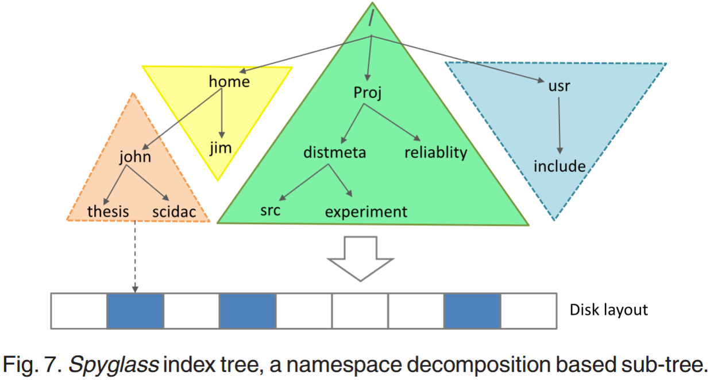

与基于DBMS建立文件元数据索引的传统方法相比，Spyglass的方法不仅将检索速度提高了8到44倍，而且将存储空间减少了5到8倍\[101]。然而，这种索引也给元数据的存储容量和组织带来了一定的负担和开销。如何将其与上述负载平衡集成是一个复杂但值得探索的问题。用更高效的索引树（如前缀树）取代k维树（KD树）可能是减少内存占用和提高性能的可行方法。例如，Masker等人\[102]提出了Hyperion，这是一种高效的内存内索引数据结构，可以显著减少索引内存占用并提高性能。基于类似的想法，SmartCuckoo\[103]改进了Cuckoo哈希方法，使用有向伪森林来表达哈希关系，从而避免了元数据索引上出现无限循环，提高了原始Cuckoo哈希的性能。

**布隆过滤器**

对于元数据的检索，华等人\[76]还提出了一种基于组之间分层划分的类似方法，称为G-HBA。与Spyglass中目录空间的子树分区不同，G-HBA将MDS组织到逻辑组中。组中的每个MDS都维护一组Bloom过滤器\[104]、\[105]作为过滤器组，表示元数据存储在该服务器上的所有文件。该服务器也被称为这些文件的主服务器（主MDS），其维护的过滤器组定期将复制信息传递给所有其他服务器。通过这种方式，每个服务器都可以容纳系统中文件的一部分到其主服务器的映射，并且每个组也可以这样来大致保持所有文件到其主服务器的映射。由于G-HBA的元数据查询不同于传统的路径名哈希方法，因此该查询可以从检测任何MDS的Bloom过滤器开始，并从本地组内到最终组间逐步执行。组之间的组织不同于Spyglass中沿目录树分解分区的分层方式。此外，它也没有固定的结构。通过这种方法很容易实现存储空间的负载平衡，但组内和组间查询必须使用多播方法，这增加了网络流量。此外，如前所述，由访问的偏斜引起的热点问题也是一个值得考虑的因素。

类似地，SoMeta\[106]和MDBF\[107]也使用Bloom过滤器来加速大规模DFS的元数据搜索过程。具体来说，MDBF是一种基于Bloom过滤器的并行元数据搜索方法，与G-HBA的分组策略不同，它是基于目录树的。多维布隆过滤器（MDBF）被实现为网络服务，支持多个元数据属性表示，每个MDBF分别与一个目录相关。与MDBF使用的目录树方法相反，SoMeta使用平面命名空间来管理元数据，这可以避免在分层命名空间中遍历延长的目录路径的开销。虽然MDBF和SoMeta的搜索性能都略有提高，但空间开销也相应增加。

并行计算是改进元数据检索的另一种有效方法，客户端可以使用多个线程并行处理元数据。例如，在Lustre中，开发了一个新功能，允许通过并行操作的远程过程调用（RPC）来操作元数据\[108]，这反过来又提高了单个客户端的多线程元数据性能。

**预取**

除了上面讨论的技术之外，元数据的来源是另一个可以用来加快元数据检索的考虑因素。出处是通过分析用户进程相对于文件的行为而派生的一种元数据。这样的元数据描述了创建项目、修改项目的过程，以及在当前位置找到项目的原因。因此，数据的出处分析可以反映文件和进程之间的相关性，并通过利用这些关系对元数据进行分区和索引，并根据相关性预先提取未被访问的元数据，来加速元数据检索。PROMES\[109]、PIndex\[110]和ProMP\[111]都是试图通过出处分析实现高查询精度和低延迟的探索。PROMES在来源分析的关系图中对数据进行索引。它利用感知相关性的元数据来构建索引树，并在存储系统收到查询请求时在索引子树中执行查询。而P-index则通过出处关系基于相关性将元数据划分为逻辑组，并截断不包含查询结果的子树，以减少搜索规模。此外，它使用来自出处的元数据构建索引树结构，这与PROMES类似。ProMP使用出处来支持元数据预取。ProMP挖掘进程与相应文件之间的相关性，然后生成来源窗口（PW）来计算同一PW中的文件访问相关性，从而实现主动预取。实验结果表明，在索引和预取中使用出处可以显著提高元数据搜索的性能。

上述基于出处的预取方法倾向于从访问历史中获得文件关联。然而，Chen等人\[112]发现，从历史共现频率进行文件挖掘的相关性并不足以用于所有文件。为了补充这种相关性，他们提出了一种称为SMeta的新方法，通过挖掘许多应用程序中存在的超链接的引用来探索显式数据相关性。基于所分析的相关性，SMeta利用相关性导向算法进行预取。该实验在Ceph的顶部实现了SMeta，并使用合成和真实系统工作负载对其进行了评估。结果表明，元数据的性能有了显著的提高。

**键值数据库**

徐等\[113]从索引可管理性、可扩展性、性能和POSIX接口支持等方面，对大数据高性能计算环境下的元数据检索进行了较为详细的讨论。总结了包括上述技术在内的现有元数据索引结果，提出了附加模型和数据库模型的分类，并对它们进行了比较。在结合文件系统和数据库优势的基础上，提出了一个文件系统级元数据管理系统VSFS\[113]。VSFS支持透明的命名空间查询和灵活的文件索引。然而，所提出的系统的单个主结构不具有大规模的可扩展性。

对于后台存储优化，IndexFS利用当前键值存储系统中常用的LSM树\[27]技术来表示和存储元数据和小文件数据。每个服务器存储和管理部分文件系统元数据，并使用LevelDB将元数据和小文件数据打包为一个扁平的大文件。巧合的是，在BlueStore（Ceph的一种新型存储后端）的体系结构中，使用一个名为RocksDB\[114]、\[115]的键值存储来存储元数据\[116]、\[117]，而不是文件系统。基于Ceph的经验，将元数据存储在RocksDB中使其能够利用快速的元数据操作。考虑到其性能的提高和一些其他优势，BlueStore在短短两年内就成为Ceph的默认存储后端。

除了快速的元数据操作外，将元数据存储在数据库中还为MDS集群提供了一个简单的选项。例如，需要一个活动名称节点（ANN）来管理HDFS中的元数据，并且至少需要一个备用名称节点来实现高可用性。因此，唯一的NameNode现在成为HDFS的性能瓶颈。为了解决这个问题，Niazi等人\[26]提出了HDFS的下一代分布，称为HopsFS，其架构如图8所示。HopsFS支持多个无状态NameNodes，并将元数据存储在外部NewSQL数据库中\[118]。

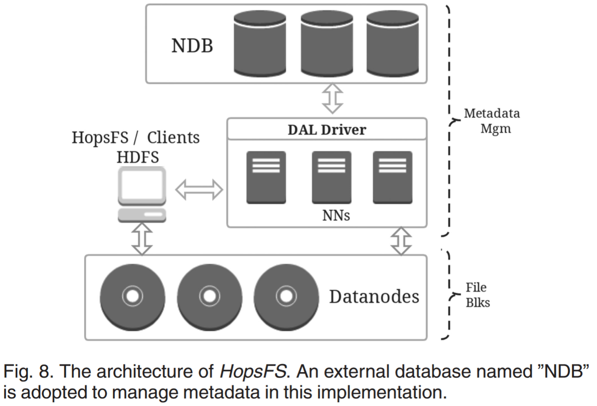

相比之下，对于IndexFS和ShardFS，MDS处理存储在本地LevelDB实例中的元数据，并利用缓存机制来提高性能。相反，HopsFS只在顶级目录中进行负载平衡。实验结果表明，对于写密集型工作负载，HopsFS的吞吐量是HDFS的37倍。

然而，尽管一些DFS试图通过使用键值存储来优化性能，但实证研究的结果并不令人满意。一些研究人员发现，键值存储和DFS元数据之间的性能差距仍然很大。从这些研究中可以看出，尽管一些文件系统通过将元数据存储在键值存储中获得了好处，但目录树之间的依赖关系仍然阻碍了文件系统充分利用键值存储的优势\[119]。为了提高MDS的性能，李等人\[120]深入研究了这个问题，并提出了一种称为LocoMeta的解决方案——DFS的扁平MDS。

如图9所示，LocoMeta提出了将目录树元数据转换为平面空间的策略，称为平面目录树。通过这种设计，元数据对象被独立地存储在平坦的空间中。评估显示，与IndexFS相比，LocoMeta实现了更低的延迟和更高效的每秒输入/输出操作（IOPS）。然而，从其他关于平面名称空间的研究来看，平面名称空间方法存在两个挑战，一个是由于缺乏逻辑组织（例如，目录树），另一个是定位特定或相关的元数据\[106]，\[121]。

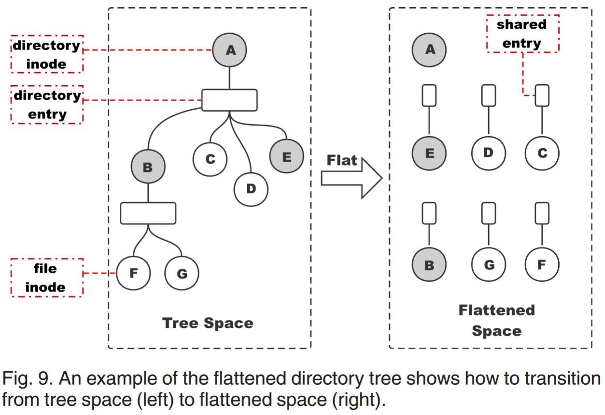

### 增值元数据

所谓的元数据增值技术是一种面向应用的技术，它建立在DFS中现有的元数据管理之上，为特定的应用集成一些特定的元数据。因此，它可以与上述索引技术相结合，专门提高某些类型应用程序的计算能力和性能。元数据增值技术可以覆盖广泛的应用，每个应用都有不同的用途。本节只关注对高性能应用程序有影响的几种技术。

为了利用一些中间结果的价值，否则这些结果将在科学计算中被丢弃，Wang等人\[122]将中间数据文件的结构和语义描述作为增值元数据添加到现有DFS的元数据管理中。这种方法可以通过跟踪和挖掘最初丢弃的文件来减少冗余的计算任务。因此，复杂科学计算的性能得到了相应的提高。

基于上述研究，王等人\[123]，\[124]进一步设计并实现了一种科学的工作负载感知文件系统，称为WaFS，该系统可以将文件之间的读写依赖信息存储在内存数据库中。这部分附加值元数据克服了现有文件系统无法记录文件之间的依赖关系的问题。工作流调度程序是一种有效的工具，可以提高工作流任务的并发性，最大限度地提高资源利用率。尽管有这一优势，WaFS仍然仅限于支持工作流计算，并且仅适用于以控制流依赖性为特征的工作流。

该领域的其他工作包括赵等人提出的分布式存储中间层技术。\[125]，\[126]用于FusionFS中的元数据密集型操作，以及Dai等人提出的“丰富元数据”概念\[127]。它不仅记录了高性能计算中相关文件实体的一些属性，还通过所提出的通用属性图集成了它们之间的关系，如世代关系，丰富了高性能计算机中对元数据的各种查询。从概念上讲，“丰富的元数据”和WaFS中提出的数据流依赖性可以相互补充。世代关系和数据依赖性表征了计算过程中文件之间的逻辑关系，这是传统文件系统无法实现的。

除了POSIX元数据之外，增值元数据还可以在进程、任务、文件等之间引入额外的关联。这些关联更像是一种图形表示，而不是单独的标志描述。因此，Dai等人\[128]设计了GraphMeta，一个用于HPC平台的基于图形的丰富元数据管理系统。尽管图方法可以方便地表示元数据关联，但图划分和图搜索的复杂性仍然使其在实践中几乎没有被采用。

作为一种集成解决方案，Sim等人\[129]结合了上述方法，提出了一种可扩展的分布式元数据索引框架，称为TagIt，它有助于实现灵活的标记功能，以支持数据发现。TagIt提供PB级别的标记功能，允许用户将自己的标记添加到元数据中，从而关联丰富的上下文信息以进行快速检索。此外，TagIt还支持对标记的文件执行操作或筛选，这些文件可以以负载感知的方式无缝卸载到存储服务器。为了验证其可行性和性能，TagIt必须在GlusterFS\[10]和CephFS\[9]中实现。实证结果表明，这种增值方法可以有效地加快数据搜索操作。

### 总结

本节介绍了几种高性能技术：缓存和复制、元数据检索和增值技术。表4总结了这些技术的比较，其中增值技术和复制技术都是通过使用额外的内存来实现的，因此，它们比元数据检索更简单、更高效。然而，增值方法通常缺乏通用性，因为它需要根据应用场景进行特定领域的优化来进行特定的设计。正是由于这个原因，它经常用于预优化元数据，而不需要像其他两个一样进行实时处理。相反，在不考虑额外空间成本的情况下，缓存和复制无疑是一种有价值的方法，可以在不关注应用程序本身的情况下提高性能。

对于高性能优化，缓存和复制机制都已以相对成熟的形式开发出来，并在几乎所有现有的DFS\[34]、\[89]中找到。此外，鉴于键值数据库的优点，将其引入元数据管理也是一种很有前途的方法，这已成为最近主流DFS\[114]、\[117]、\[130]的趋势。此外，作为数据管理员的优化方法，各种DFS还为增值方法提供了扩展接口，例如二级和三级索引\[128]，\[129]。所有这些方法都是正交的，因此可以集成以执行各种目的。然后，我们预计未来的DFS将一次性支持所有这些优化方法，这是DFS发展的自然演变。

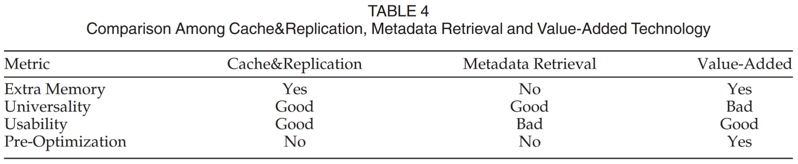

## 用于元数据服务的高可用性技术

由于规模的不断扩大，MDS总是面临潜在故障的风险。为了确保其不间断的服务，MDS集群需要具有高可用性。如前所述，在共享集群文件系统中，对于每个分区目录，随机选择几个候选MDS，并且目录子集将存储在目录条目较少的目录中，以提高MDS的可用性。

### 基于拷贝的高可用性元数据服务

通过多个MDS执行分布式元数据管理，以克服集中式元数据管理的单一点，从而提高元数据的可用性。虽然一些MDS故障不会使整个系统崩溃，但它可能在一定程度上影响系统的正常访问。为了实现MDS集群的更高可用性，我们可以采用冗余技术进行元数据管理，根据集群中的工作负载分布，将每个MDS上的元数据备份到其他MDS。Hadoop和GFS都使用基于副本的元数据管理。考虑到元数据恢复时间，元数据备份可分为重启恢复模式和热备份模式。

元数据的恢复过程主要是将元数据从一个MDS备份到其他MDS，并定期设置检查点。当MDS出现故障时，可以启用备份MDS以从最新的检查点开始加载元数据，从而可以在该点恢复MDS。这种模式的优点是开发简单方便，但最大的隐患是元数据的不一致性。此外，元数据在检查点之后更新的无法恢复。为了解决这些问题，通常会结合日志方法，使备用MDS的恢复元数据成为最新版本。然而，重新启动和恢复仍然需要一定的切换时间，因此无法进行实时恢复。

与用于恢复元数据的方法一样，还需要热备份方法来选择备用MDS以成为活动MDS。这两个MDS都可以访问共享存储设备中的目录，并且这些目录存储用于更新命名空间的日志。备用MDS将检测日志，并将所有日志记录更新到其自己的服务器。数据存储服务器的数据位置信息和心跳检测被发送到两个MDS，以便可以实时更新相应的信息。一旦MDS出现故障，就会有一个备份MDS来替换它。Hadoop的元数据管理就是基于这种高可用性（HA）原则。

尽管HA在HDFS中得到了广泛的应用，但仍存在一些明显的不足。例如，检查点机制导致元数据状态的大小受到限制，这是在MDS的内存中需要的。为了解决这个问题，Stamatakis等人\[131]提出了一种用于复制MDS的新架构，称为HDFS-RMS。

图10说明了HDFS-HA和HDFS-RMS之间的区别。HDFS-HA中只有两个名称节点，一个活动名称节点和一个备用名称节点，而HDFS-RMS体系结构由一个主节点和任意数量的从节点组成。每当主服务器崩溃时，可以通过切换到新的NameNode来恢复服务，该NameNode为Oracle Berkeley DB（BDB）。

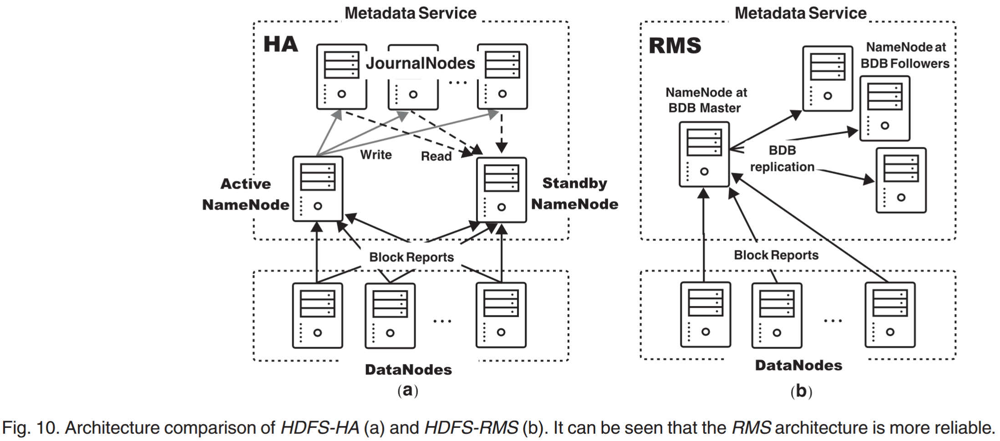

在GFS中，在某些情况下，备用MDS可以提供对某些文件的只读访问。如果在MDS上指定了高可用模块，则在屏蔽故障信息的同时将MDS提供给系统，从而当MDS失败时，元数据请求自动切换到另一个候选MDS，从而实现对客户端的高透明度和高可用性。这种方法可以确保更好的数据一致性和更短的切换时间，但增加了一定的复杂性，给系统维护带来了很大的压力。

BeeGFS\[8]中的高可用解决方案与GFS类似。BeeGFS中具有高可用性的元数据镜像称为伙伴组。在伙伴组中，元数据在以彼此为目标的一对服务器之间复制，这意味着当一半的服务器出现故障时，伙伴组方法仍然可以访问。BeeGFS中好友组的设计如图11所示。每个组都是两个目标之间的复制。通常，伙伴组中的一个MDS被视为主要MDS，而另一个是次要MDS。修改操作将始终首先发送到主服务器，并且镜像进程正在主服务器中运行。一旦无法访问伙伴组的主MDS，它将被标记为脱机，以前的辅助MDS将成为新的主MDS。这样的故障切换是透明的，并且在运行应用程序时不会丢失任何数据。

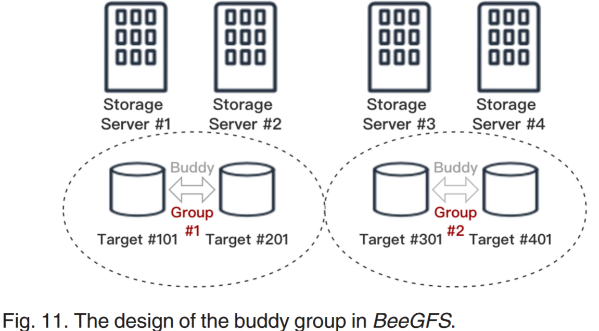

Farsite\[83]和Archipelago\[132]都利用基于复制的方法来管理元数据。为了减少复制造成的开销，Archipelago将集群中的节点划分为几个小岛，并将元数据复制到每个小岛上，以实现不间断的MDS。相反，Farsite将元数据复制到多个节点。为了减少由此产生的开销，对元数据的修改会记录在日志中，并定期复制到其他MDS。Chen等人\[133]使用类似的技术为曙光集群文件系统（DCFS3）设计了一个高可用的MDS。其基本思想是减少压缩多Paxos的延迟，同时最大限度地减少副本数量引起的一致性协议开销。周等人\[134]，\[135]提出了一种新的MDS高可靠性策略，称为多活动多备用（MAMS）。与Archipelago类似，MAMS将MDS划分为不同的副本组，并在每个组中维护多个备用节点以进行故障切换。与传统策略相比，MAMS中MDS有三种状态：主动、备用或初级。主动MDS负责在线管理，而备用MDS与主动节点保持最新，初级MDS是被动备用服务器。实验结果表明，与传统的HA原理相比，MAMS策略可以实现更快的透明容错，对元数据操作的影响更小。

### 基于日志的高可用性元数据服务

基于复制副本的MDS不可避免的问题之一是延迟。为了减少元数据访问的磁盘I/O数量，通常使用缓存技术来保存部分元数据操作。MDS故障后，缓存的元数据项将丢失。因此，为了提高MDS的可用性，文件系统需要能够持久保存所有元数据修改。因此，它通常需要一个日志方法来记录每个MDS的元数据修改。即使缓存中的数据丢失，仍然可以根据日志恢复数据。

在共享磁盘集群中，元数据和日志存储在基于共享磁盘阵列的存储（如存储区域网络（SAN））中。为了保持元数据的一致性，GPFS利用分布式锁实现对元数据的多用户同步访问，分布式锁比集中式管理具有更好的并发性\[75]。GPFS元数据上的更新操作通过提前写日志（WAL）机制实现文件系统的一致更新。尽管共享磁盘集群在保持元数据一致性方面相对简单，但它们也面临“热文件”问题，无法应对不同数据中心广域网（WAN）环境中不稳定和高延迟的网络流量\[136]。

在无共享集群中，元数据以多个副本的形式分布在多个独立的MDS上。修改操作很容易涉及多个MDS上的元数据，并且元数据的一致性变得更加复杂。为了设计一个能够在WAN环境中执行良好的元数据集群，根据CalvinFS\[136]的思想，元数据修改操作添加了分布式事务逻辑和用于锁管理的调度器，以通过Paxos协议同步元数据日志\[137]。正常的Paxos协议在同步每条元数据时通常需要两个阶段。相比之下，一些研究在基于副本的元数据管理研究中使用Multi-Paxos协议\[138]来同步日志，从而减少了减少网络开销的第一阶段的数量。尽管Google的Chubby\[139]将这种基于Paxos协议的元数据管理用于同步日志，但众所周知，Paxos的协议复杂且难以实现。相比之下，Raft一致性协议\[140]更易于理解和实现。在Cloudera开发的大型开源存储引擎Kudu中，平面副本管理（TRM）是通过Raft协议实现的\[141]。

尽管元数据和数据的分离使读写逻辑更加清晰，但它增加了访问磁盘的次数。由于每个元数据占用少量存储空间，因此可以压缩数据块，留下少量空间嵌入元数据，从而可以一次性写入数据和元数据，以减少磁盘I/O开销。Selfie\[142]利用了这一原理，即即使所有MDS集群崩溃，文件系统的元数据仍然可以通过扫描数据块快速重建，并为系统提供服务。此外，与将元数据复制到其他MDS相比，这种方法还可以减少网络开销和额外的同步操作。

### 总结

在本节中，我们介绍了元数据管理中最流行的两种高可用性技术：基于副本的技术和基于日志的技术。它们之间的比较如表5所示，其中比较了五个指标：可用性、一致性、切换时间、延迟和网络开销。如表所示，与基于日志的方法相比，基于复制的方法在可用性、切换时间和延迟方面表现更好，但在一致性和网络开销方面较差。我们可以将这些结果归因于这样一个事实，即基于拷贝的方法利用主节点和备用节点之间的网络传输进行实时数据同步，从而降低了这些节点之间的同步开销。同时，当主节点崩溃时，备用节点可以立即切换到主节点。然而，这种同步机制是一把双刃剑，因为当服务崩溃或网络数据包丢失时，它也可能导致数据不一致。相比之下，使用基于日志的方法可以成功避免数据不一致问题，该方法可以利用补充日志来保持所有元数据修改，从而在服务崩溃时重新构建MDS。

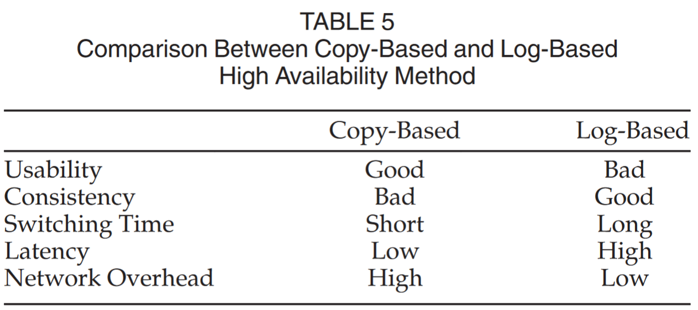

许多DFS\[34]、\[75]、\[131]通过基于拷贝的方法提供了一种灵活的替代MDS，在主故障的情况下可以快速切换到辅助MDS。同时，他们将元数据操作记录到文件中，以便在发生故障时从这些日志中恢复，从而提供更稳定可靠的MDS服务。因此，在现实中，这两种方法——基于拷贝和基于日志的技术——经常结合在一起，以实现高系统可靠性。此外，主动检测、定位和故障诊断也是提高可用性的有趣和有价值的研究方向。Jha等人\[143]提出了一个名为Kaleidoscope的故障检测和诊断框架，该框架已部署在PB级DFS上，用于检测资源过载/争用问题中的故障，以提高DFS的可用性。通过引入主动检测机制，DFS可以在崩溃前检测故障，从而进一步提高可用性，因此提前检测故障是MDS中值得研究的问题。

在当今硬件性能和网络带宽快速发展的时代，基于复制和基于日志的方法带来的额外开销可以忽略不计。相反，我们更关心的是如何快速检测故障并及时恢复。因此，主动检测、故障定位和快速切换有望成为DFS可用性的关键词。

## 未来趋势

元数据的应用是多视角和全方位的\[90]，\[119]，\[128]。为了提高其在各种应用中的性能，对元数据管理的高效和可扩展技术的研究仍然需要迫切的需求。近年来，这一趋势日益突出，预计将在以下三个新兴领域体现出来\[31]、\[34]、\[62]、\[102]、\[103]、\[144]。

### 基于人工智能的元数据

当前主流的高可扩展性和高性能方法通常侧重于特定类型的工作负载。由于人工智能工作负载在当今大多数应用程序中占主导地位，我们预计DFS的总体设计，尤其是MDS的设计，将有效支持人工智能应用程序，这是一种趋势。例如，Bae等人\[145]提出了FlashNeuron，它可以利用NVMe SSD来优化深度学习的训练过程。实证结果表明，所提出的存储优化可以显著提高深度学习算法的吞吐量。此外，Kumar等人\[146]提出了Quiver，这是一种专门为深度学习框架Pytorch优化的缓存系统。由于迭代计算的性质，分布式学习框架具有一些特定的特性。关于如何为他们设计定制的高性能DFS的一些见解可以在\[147]中找到。

相反，作为一种有效的优化方法，我们还设想了人工智能算法在MDS的高性能和高可扩展性技术中的应用\[98]，\[148]。例如，Gao等人\[148]提出了一种基于机器学习的模型，称为DeepHash，以利用深度学习算法来设计元数据位置映射。此外，从系统的角度来看，强化学习（RL）\[149]非常适合于负载平衡等动态优化场景。因此，Wu等人\[150]提出了MDLB，一种基于RL的动态元数据负载平衡机制，以实现MDS负载平衡的效率和动态适应性。

### 新的基于介质的存储

新材料的革命也将带来MDS性能和可扩展性的飞跃。新存储（如SSD和NVMe）以及远程直接内存访问（RDMA）的出现极大地提高了元数据服务器集群的吞吐量。高速数据I/O能力无疑将为MDS的性能提升带来强大的推动力。因此，我们相信这些革命将成为未来高度可扩展MDS集群的关键技术。

与硬盘驱动器（HDD）相比，固态驱动器（SSD）具有存储密度高、能耗低、读写性能好、无需经过内核即可直接用于用户空间等特点，对提高文件存储系统的性能有很大帮助。鉴于这些优势，最近的许多研究工作都集中在采用SSD作为DFS基底\[38]、\[43]、\[45]、\[151]、\[152]。

CosaFS\[43]是一种建立在异构存储设备之上的典型文件系统，它结合了SSD和叠片磁记录（SMR）\[153]技术来提高I/O性能。目前，主流的SSD存储是基于哈希的键值SSD。尽管其性能很有希望，但在其控制器DRAM中维护哈希表通常会导致尾延迟和吞吐量不一致。为了充分释放SSD的潜力，Im等人\[130]，\[154]提出了PinK，一种基于LSM树的KV SSD，以避免哈希冲突对性能的影响。Lee等人\[155]提出了一种新技术，称为SmartSSD，一种带有FPGA的SSD，用于在SSD内提供计算能力。SmartSSD有望成为DFS的一场潜在革命。

非易失性存储器（NVM）是一种新兴的尖端技术，具有比SSD更高的读写速度，对文件系统性能有着显著的提升，通常被视为下一代存储基板。因此，Ziggurat\[151]将SSD与NVM集成，以设计一种文件系统，该文件系统可以提供比单独使用SSD的文件系统数倍的性能改进。与CosaFS和Ziggurat不同，ZoFS\[45]完全建立在NVM之上，并利用一种名为Coffer的新抽象，使用户空间库能够完全控制NVM，试图打破内核级NVM的性能瓶颈。尽管对于这些系统来说，采用新介质的结果是有希望的，但尚不清楚这些技术是如何扩展到大规模分布式存储系统的。

与上述研究不同的是，PolarFS\[38]是阿里云先进的分布式文件系统，它充分利用了RDMA、NVMe和存储性能开发工具包（SPDK）等新兴技术，大规模实现了I/O性能的最大化，这与Ceph在精神上有一些相似之处，Ceph也扩展了NVM和RDMA，以提高I/O性能。Assise\[152]进一步深入了解了如何在客户端使用NVM优化DFS性能，并通过实验展示了其相对于NVM版本Ceph的性能优势。

虽然NVM和突发缓冲器\[156]等新技术提高了DFS的性能，但它们也要求研究人员重新思考他们在数据管理和I/O操作方面的方法。吴等人\[150]对新型存储材料的优势和劣势进行了更详细的描述。

### 非元数据服务

至于可用性，在当前基于MDS的DFS中，需要大量的日志或数据流备份来实现数据一致性。这种实现不仅浪费了大量资源，而且元数据服务器的故障仍然是可用性的主要障碍。与非基于MDS的DFS相比，具有MDS的DFS将使用额外的元数据服务器，这反过来又增加了数据访问的关键路径。因此，服务器崩溃（特别是元数据服务器）不仅会对I/O性能产生不利影响，而且可能会中断DFS的数据访问可用性。相比之下，在非DFS中，客户端通常采用哈希函数来定位数据，避免了元数据服务器崩溃导致的不可用性。因此，作为一种替代方案，非MDS体系结构将成为未来提高可用性的重要探索。

理想情况下，该模型还可以显著提高系统的可扩展性，使系统在并发性和性能方面实现线性扩展和增长。我们认为，非元数据服务模型的主要障碍可能是复杂的数据一致性问题和操作，如低效的文件目录遍历。此外，MDS模型还大大降低了系统的全局监控能力，同时增加了客户端的工作负载（如文件位置的计算）。如何有效地解决这些问题值得进一步研究。

此外，对于实际应用，元数据管理不应局限于系统级信息。元数据增值技术在各种特定应用中仍有广阔的发展空间，如具有压缩和复制功能的文件系统、具有加密和安全功能的文件体系等，如何实现高效的可扩展性是DFS大规模部署和应用的重要前提，值得进一步研究和探索。

最后，随着大数据时代的到来，数据量呈指数级增长，PB级的文件系统逐渐无法满足存储容量的需求。当前的大型文件系统主要是为EB级别的数据卷设计的。在这种情况下，元数据量的管理也应该相应地达到PB级别，这是以前数据量的级别。这种级别的元数据无疑对元数据管理技术提出了巨大挑战。

